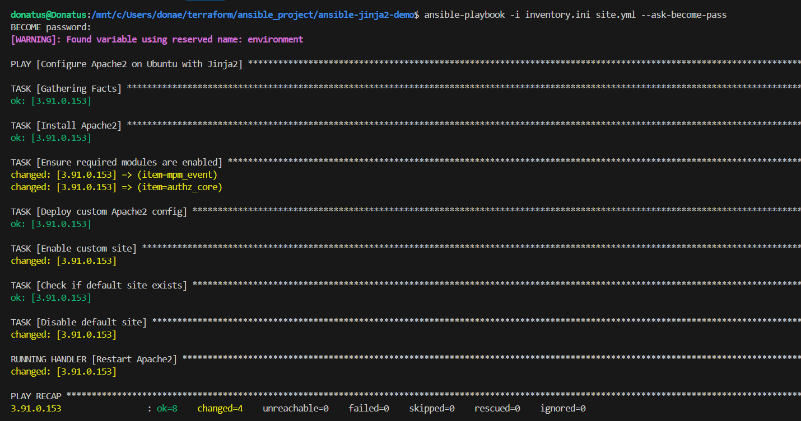

## Apache2 Automation with Ansible and Jinja2

This project automates the installation and configuration of Apache2 on Ubuntu servers using Ansible. It also uses a Jinja2 template to deploy a custom site configuration and manage environment-specific log files.

## Features

- Installs Apache2 automatically on Ubuntu servers.

- Enables essential Apache2 modules (mpm_event and authz_core).

- Deploys a custom Apache2 site configuration using Jinja2 templates.

- Disables the default Apache site if it exists.

- Generates environment-specific logs (for example: dev_error.log and dev_access.log).

- Fully idempotent: running the playbook multiple times is safe.

## Project Structure

ansible-jinja2-demo/

├── inventory.ini             # Target servers and SSH details

├── site.yml                  # Main Ansible playbook

├── templates/

│   └── apache2.conf.j2       # Jinja2 template for the site configuration

└── README.md                 # Project documentation

## Jinja2 Template

- The apache2.conf.j2 template dynamically sets:

- ServerName

- DocumentRoot

- Environment (used in log file names)

This ensures each environment has its own log files and configuration.

## How It Works

1. Installs Apache2 on the target server.

2. Enables required Apache2 modules.

3. Deploys a custom site configuration using the Jinja2 template.

4. Enables the custom site and disables the default site if it exists.

5. Restarts Apache2 whenever a change is made.

## Usage

- Clone the repository: https://github.com/donaemeka/ansible-apache2-automation.git

cd ansible-apache2-automation

- Update inventory.ini with your server details:

[webserver_aws]

<server_ip> ansible_user=<username> ansible_ssh_private_key_file=<path_to_your_private_key>

- Run the playbook:

ansible-playbook -i inventory.ini site.yml --ask-become-pass

## Check that Apache2 is running:

- sudo systemctl status apache2

## Example Playbook Run

Here’s a screenshot showing the playbook running successfully:

## View logs for your environment:

- sudo less /var/log/apache2/dev_error.log
- sudo less /var/log/apache2/dev_access.log

## What I Learnt From This Project

1. Automating server setup with Ansible.

2. Using Jinja2 templates to create dynamic configuration files.

3. Writing idempotent and safe playbooks that can run multiple times without issues.

4. Managing Apache2 modules, sites, and logs programmatically.

## About Me

Hi, I’m Donatus, a recent DevOps and Cloud Computing graduate from Ironhack Germany.  

I enjoy automating infrastructure, working with Ansible, Terraform, and Kubernetes, and building end-to-end cloud solutions.  

This project is part of my portfolio to showcase my skills in:

- Server automation with Ansible

- Jinja2 templating for dynamic configurations

- Managing Apache2 sites and logs on Ubuntu servers

